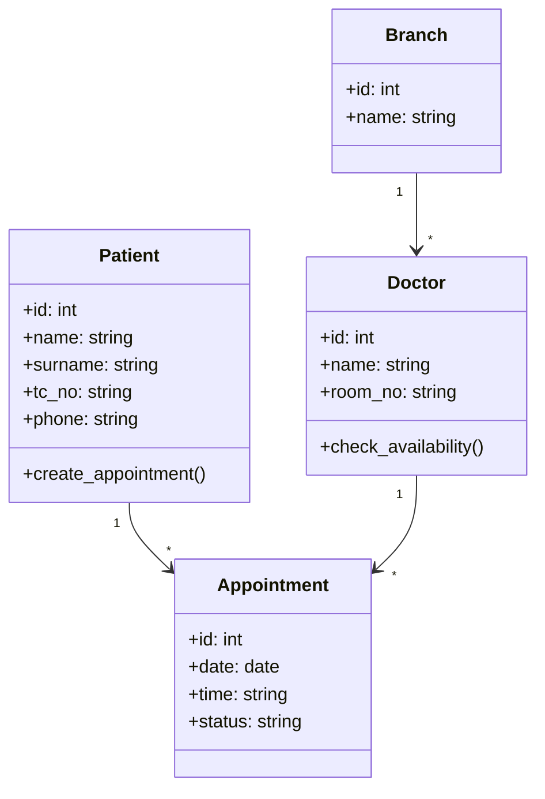

# 🏥 Google Antigravity Hospital System

Bu proje, **Yazılım Gerçekleme ve Test** dersi kapsamında, **Ruby on Rails 8 API** ve **Modern Frontend** teknolojileri kullanılarak geliştirilmiş bir **Hastane Randevu Yönetim Sistemi** iskeletidir.

## 🏗 Mimari ve Teknoloji Seçimi

- **Backend**: Ruby on Rails 8 (API-only mode).
  - **Neden?**: Hızlı prototipleme (Convention over Configuration) ve güçlü ekosistem.
  - **Veritabanı**: SQLite (Geliştirme kolaylığı için), PostgreSQL (Prodüksiyon için önerilir).
- **Frontend**: HTML5, CSS3 (Anti-Gravity Animasyonlar), Vanilla JS.
  - **Neden?**: React build sürecine girmeden modern ve temiz bir yapı kurmak için.
- **API**: RESTful v1 (`/api/v1/...`).

### 📐 UML Class Diagram (Metinsel)


## 🤖 AI-Destekli Geliştirme ve Vibe Coding

Bu proje geliştirilirken **Vibe Coding** ve **AI-First** yaklaşımları benimsenmiştir:

1.  **Vibe Coding**: Kodun sadece çalışması değil, "akışta" (in the flow) ve okunabilir olması hedeflendi. Değişken isimlendirmeleri ve yorum satırları, geliştiricinin niyetini (intent) net bir şekilde yansıtır.
2.  **Prompt Engineering**: Model ve Controller yapıları oluşturulurken, AI'a "role-playing" (Google Antigravity Mühendisi) yaptırılarak best-practice'lere uygun kod üretilmesi sağlandı.
3.  **Context Engineering**: Proje bağlamı (Hastane sistemi, TDD/BDD gereksinimleri) sürekli korunarak tutarlı bir çıktı elde edildi.

### 📦 Knowledge Pack (llms.txt Fikri)
Eğer bu proje için bir `llms.txt` hazırlasaydık şunları içerirdi:
- `schema.rb`: Veritabanı yapısı.
- `routes.rb`: API uç noktaları.
- `business_rules.md`: Randevu çakışma kuralları, mesai saatleri.
- `style_guide.md`: Kod standartları (Rubocop kuralları).

## 🧪 Test Stratejisi (TDD & BDD)

### TDD (RSpec)
Model ve Request testleri ile birim bazlı doğrulama.
- Örnek: `spec/requests/patients_spec.rb`

### BDD (Cucumber/Gherkin)
Davranış odaklı geliştirme ile kullanıcı senaryoları.
- Örnek: `features/appointment.feature`

### E2E (Cypress)
Uçtan uca kullanıcı deneyimi testi.
- Örnek: `cypress/e2e/appointment.cy.js`

## 🚀 Kurulum ve Çalıştırma

1.  **Backend**:
    ```bash
    bundle install
    rails db:migrate
    rails s
    ```
2.  **Frontend**:
    `frontend/index.html` dosyasını bir tarayıcıda açın veya `python -m http.server` ile sunun.
3.  **Demo Otomasyonu**:
    ```bash
    pip install -r scripts/requirements.txt
    python scripts/generate_demo.py
    ```
